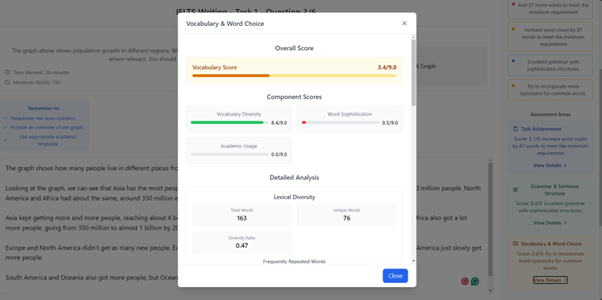
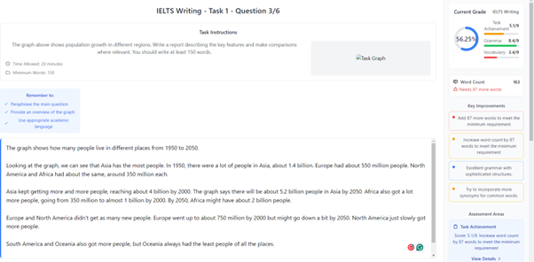
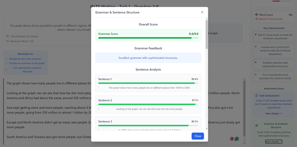

# English Ready

## Project Overview
This repository presents an IELTS preparation chatbot built with Microsoft Bot Framework (C#) enhanced with Python ML models. The platform provides personalised learning experiences and adaptive feedback on writing tasks according to official IELTS criteria.

## Features:

### AI-Powered Writing Analysis
Real-time feedback on IELTS writing tasks using advanced machine learning models that evaluate:
- Grammar Correction
- Task Achievement
- Coherence and Cohesion
- Lexical Resource Analysis

  
  
<em>Detailed vocabulary assessment with component scores</em>

  
  
<em>Intuitive writing interface with dashboard and feedback</em>

  
  
<em>In-depth grammar analysis with sentence-by-sentence breakdown</em>

### Personalized Learning
Adaptive system that identifies specific weaknesses and suggests targeted improvements to help users achieve higher IELTS scores.

## Technology:
- Microsoft Bot Framework (MBF)
- C# MVC Backend
- Python ML Grading Models
- REST API Integration
- React Frontend (modern gamified user interface)

## Requirements:
- .NET 6.0+
- Bot Framework SDK
- Python 3.8+
- Azure Bot Service (for deployment)
- Node.js
